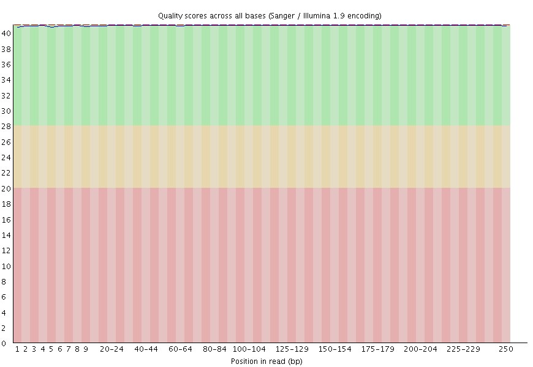
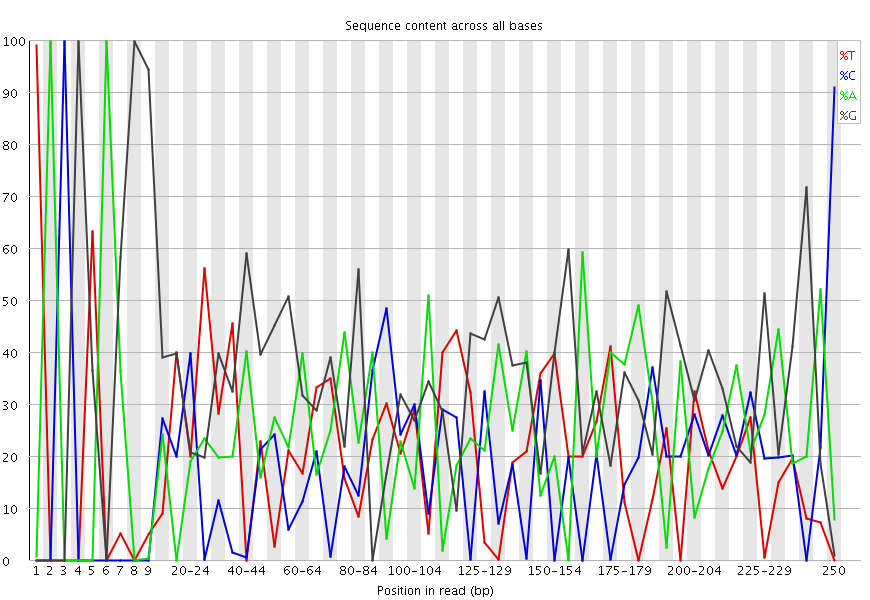
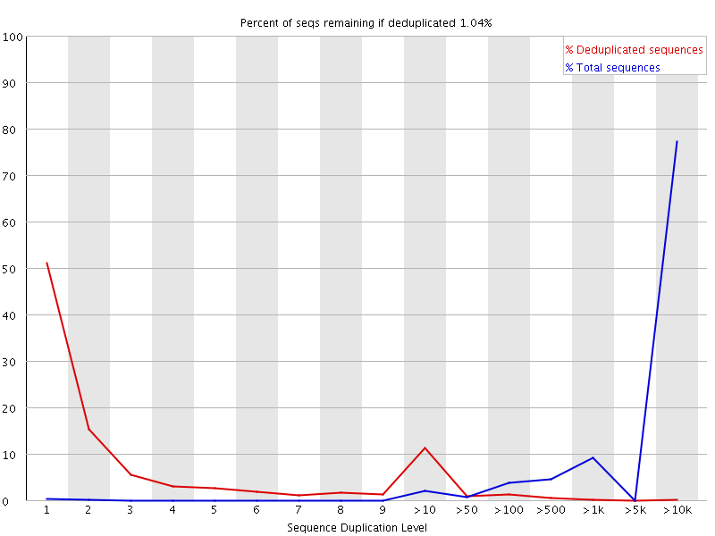
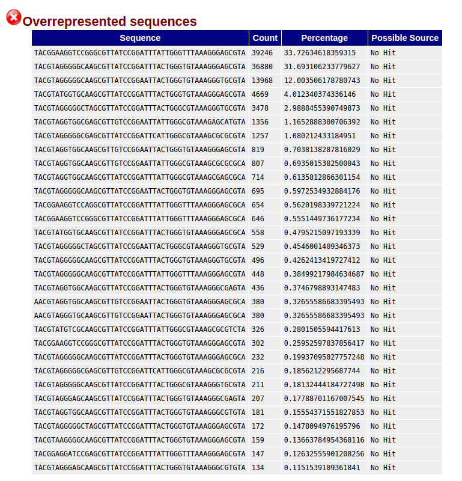

```{r setup, include=FALSE}
knitr::opts_chunk$set(echo = TRUE)
```
# Assessment data info
```{r, include=FALSE}
assessment.meta <- read.table("assessment.run/assessment.dataset1.metadata.tsv",sep ="\t", header = TRUE)
```
```{r, echo=FALSE}
assessment.meta
```

Two cat samples and each sample went under seven treatments. Based on the info we got from the training data we can assume *There are seven cats which are treated with increased percentage of a compound in their diet. 7 different treatments (1-7, representing an increased percentage of a compound in their diet)*


# Investigating raw read counts
```{r, include=FALSE}
assessment.raw.fastq.counts <- read.table(file = "assessment.run/qc/extra/raw.fastq.counts", sep = '\t', header = FALSE)
names(assessment.raw.fastq.counts) <- c("Samples_ID","Fwd_read_count","Rev_read_count")
assessment.raw.fastq.counts$Total_count <- assessment.raw.fastq.counts$Fwd_read_count + assessment.raw.fastq.counts$Rev_read_count
```


```{r, echo=FALSE}
assessment.raw.fastq.counts
```


```{r}
summary(assessment.raw.fastq.counts$Total_count)
```

## Questions
1. Does the numbers reflect similar HiSeq / MiSeq runs? **MiSeq**

## Investigating FastQC plots

Summary of FastQC reports are [here](http://web.cbio.uct.ac.za/~gerrit/16Snodeassessment/assessment.run/qc/fastqc/fastqc_plots.htm) 

### Questions
1. Does the 52% GC content reflect microbial samples? **No completely random** 
2. Does the graphs show what is expected.
  + Differences in forward and reverse read qualities.


 + Is there anything to be worried about the per tile quality heatmap plot?

 + A very mixed per base sequence content distribution.
 
 + High duplication levels.
 
 + High levels of overrepresentation of sequences.
 
3. Read lengths are 300bp. Is this normal to expect form MiSeq runs? How should we set our filtering (done after merging) based on this.
4. Which variable region does our reads hit? Does it make sense in terms of the sequence technology/platform used?


#Investigating filtered/trimmed reads

```{r, include=FALSE}
filtered_fastqs.counts <- read.table(file = "assessment.run/qc/extra/filtered_3.fastq.counts", sep = "\t", header = FALSE)
names(filtered_fastqs.counts) <- c("Samples_ID","read_count")
```


```{r, echo=FALSE}
filtered_fastqs.counts
```


```{r}
summary(filtered_fastqs.counts$read_count)
```

On average ~13% of reads are dropped after filtering (we can recheck this)

```{r}
(124950-108600)/124950
```

## Investigating FastQC plots

Summary of FastQC reports on filtered/trimmed reads are [here](http://web.cbio.uct.ac.za/~gerrit/16Snodeassessment/assessment.run/qc/fastqc.filtered_3/fastqc_plots.htm)

### Remarks
1. We still have a 52% GC content reflect microbial samples.
2. Does the graphs show what is expected.
 + Now we have high quality reads only. There is also nono low hanging tails. Forward and reverse reaeds are now merged.

 + We still have a verry mixed per base sequence content distribution.

 + High duplication levels remains.

 + High levels of overrepresentation remains.
