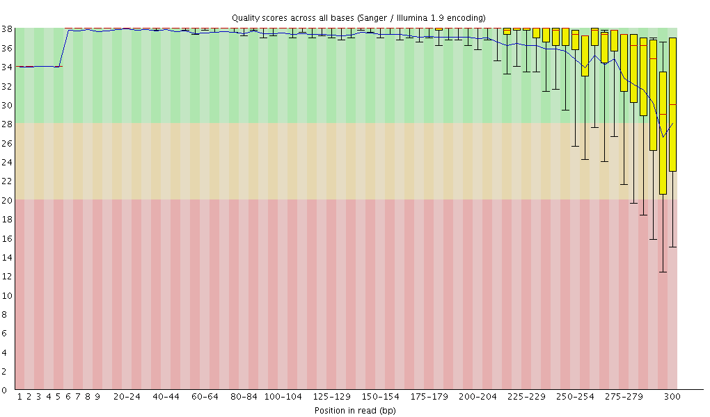
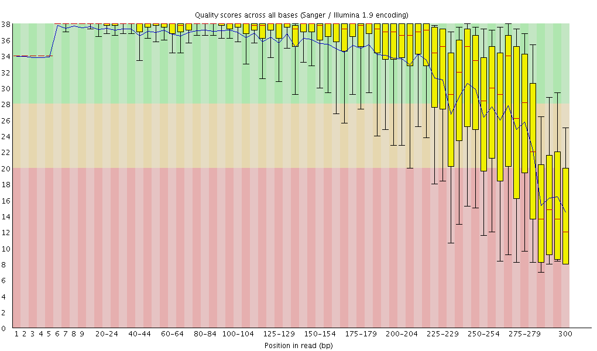
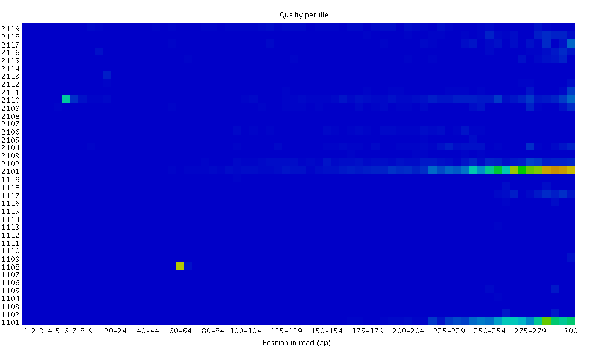
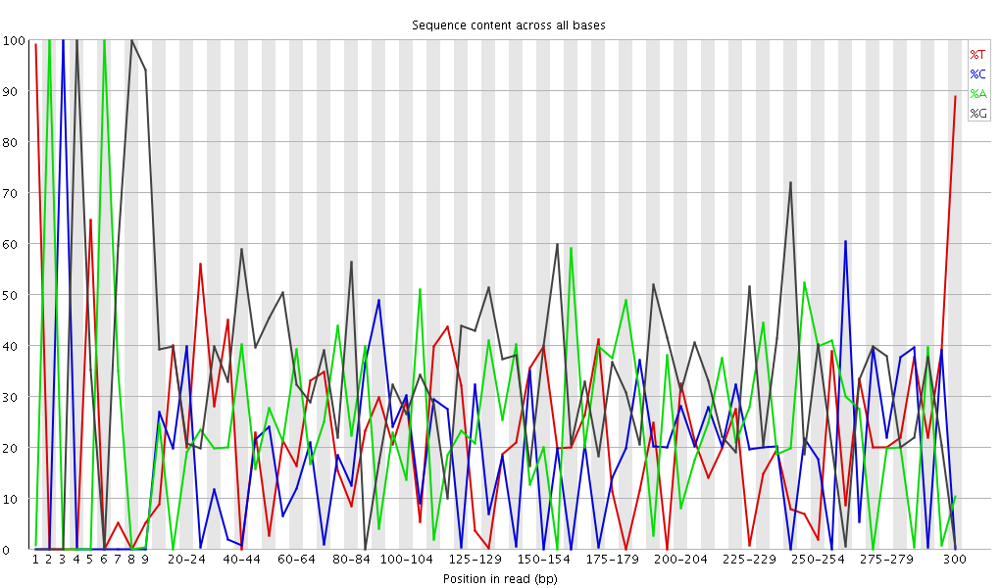
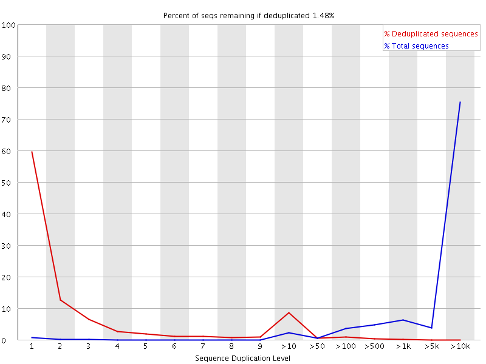
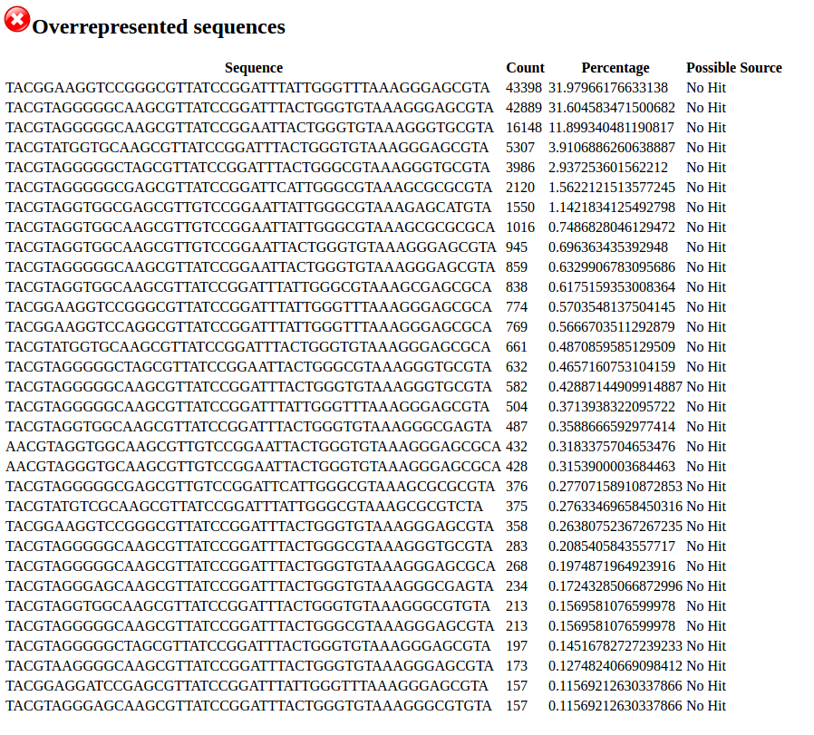

```{r setup, include=FALSE}
knitr::opts_chunk$set(echo = TRUE)
```

## Investigating raw read counts
```{r, include=FALSE}
assesment.raw.fastq.counts <- read.table(file = "assessment.run/qc/extra/raw.fastq.counts", sep = '\t', header = FALSE)
names(assesment.raw.fastq.counts) <- c("Samples_ID","Fwd_read_count","Rev_read_count")
assesment.raw.fastq.counts$Total_count <- assesment.raw.fastq.counts$Fwd_read_count + assesment.raw.fastq.counts$Rev_read_count
```


```{r cars, echo=FALSE}
assesment.raw.fastq.counts
```


```{r}
summary(assesment.raw.fastq.counts$Total_count)
```

### Questions
1. Does the numbers reflect similar HiSeq / MiSeq runs?

## Investigating FastQC plots

Summary of FastQC reports are [here](http://web.cbio.uct.ac.za/~gerrit/16Snodeassessment/assessment.run/qc/fastqc/fastqc_plots.htm) 

### Questions
1. Does the 52% GC content reflect microbial samples?
2. Does the graphs show what is expected.
  + Differences in forward and reverse read qualities.

  
  + Is there anything to be worried about the per tile quality heatmap plot?
  
  + A very mixed per base sequence content distribution.
   
  + High duplication levels.
  
  + High levels of overrepresentation of sequences.
   
3. Read lengths are 300bp. Is this normal to expect form MiSeq runs? How should we set our filtering (done after merging) based on this.


